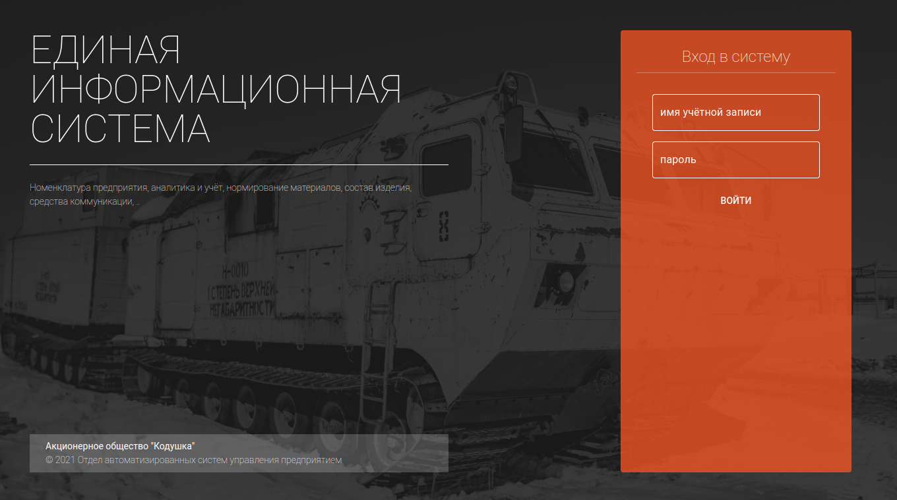
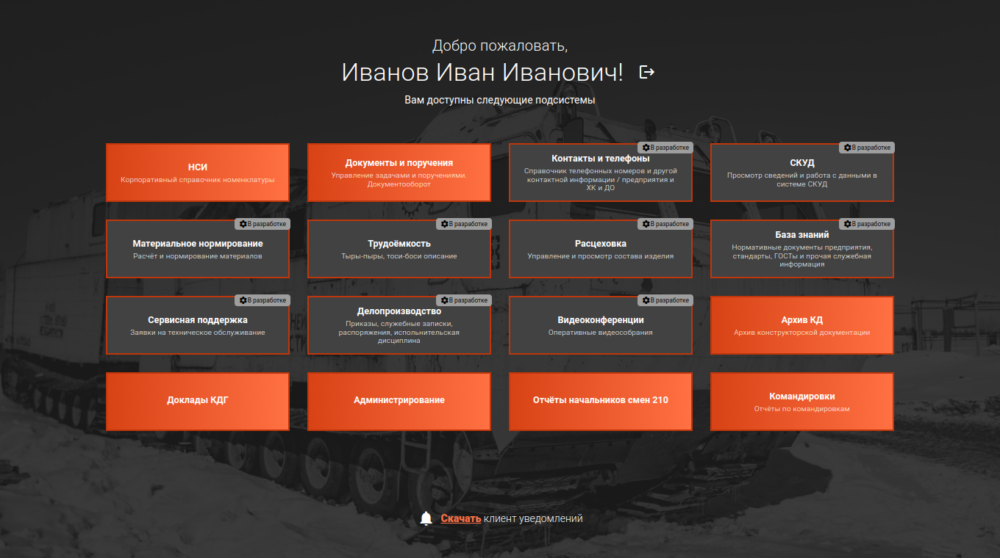

# ЕИС модуль домашней страницы

ЕДИНАЯ ИНФОРМАЦИОННАЯ СИСТЕМА.

Модуль домашней страницы (dashboard). Предоставляем пользователю возможность авторизации в системе, выводит обобщённую информацию (новости, уведомления) и даёт возможность выбора последующего модуля для работы.

